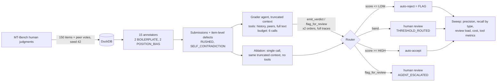

# second-reader

Every large-scale human data operation has the same quiet problem: the people
producing your training data are themselves a noisy process, and the QA layer
that watches them is usually a spreadsheet and a spot-check. second-reader is
a public-data approximation of that QA problem, built on MT-Bench human
judgments: 15 synthetic annotators submit pairwise-preference votes with
written justifications; four of those annotators are defective in ways that
are **invisible item-by-item** (verbatim template reuse, always voting the
same side), and a labeled share of the remaining items carry item-level
defects (rushed one-liners, justifications that contradict the vote). A
**tool-using grader agent** — starting from deliberately truncated context —
decides for itself whether to pull the annotator's history, peer judgments,
or the full response texts before emitting a rubric-scored verdict, or
escalating to a human. Because defect ground truth is recorded at both the
annotator and item level, the flagging decision has real precision and
recall, and because the same items are also graded by a single tool-less
call, the value of giving the grader an evidence loop is *measured*, not
asserted.

## Headline: recall by defect type, tools on vs tools off

> **Status: the live run is blocked on `ANTHROPIC_API_KEY` — see
> [STATUS.md](STATUS.md).** Nothing below pretends otherwise. The measurement
> machinery is verified two ways: the precision/recall math is pytest-tested
> against a fixture with known labels
> ([tests/test_metrics.py](tests/test_metrics.py)), and the entire pipeline —
> agent loop, tool protocol, traces, ablation, sweep — ran end-to-end with a
> deterministic mock client that speaks the tool-use protocol. The table
> below is from that **mock run**: it demonstrates the measurement and the
> shape of the result, **not** model performance. `make run` (with a key set)
> regenerates it with real claude-sonnet-4-5 numbers in
> [results/metrics.md](results/metrics.md).

Operating point HIGH=0.75 / LOW=0.35, 150 items, 66 defective — **MOCK GRADER**:

| Defect type | Injected | Recall, tools OFF | Recall, tools ON | Catch incl. escalation (ON) |
|---|---|---|---|---|
| RUSHED | 14 | 100.0% | 100.0% | 100.0% |
| BOILERPLATE | 20 | 0.0% | 90.0% | 90.0% |
| POSITION_BIAS | 18 | 0.0% | 77.8% | 77.8% |
| SELF_CONTRADICTION | 14 | 28.6% | 28.6% | 28.6% |
| **Overall** | 66 | **27.3%** | **75.8%** | **75.8%** |

The structure of this table is the point of the project. The two
annotator-scoped defects (BOILERPLATE, POSITION_BIAS) sit at **0% without
tools by construction** — no single-item grader, however smart, can see a
cross-item pattern. They become catchable exactly when the grader can pull
`get_annotator_history`. RUSHED needs no tools at all. SELF_CONTRADICTION is
hard in both modes: it is a per-item reasoning problem, and the tool loop
contributes little. Full sweep (126 threshold configs × 2 modes):
[results/mock/calibration.csv](results/mock/calibration.csv).

Tool-use metrics (mock run): mean **3.1 evidence calls per run**, **7.3%** of
runs hit the 6-call cap and were forced to a verdict (recorded as
`budget_exhausted`), and defective-annotator items resolve cheapest (~1.5
calls — history alone settles them) while clean items cost the most (~4.1
calls — the agent reads everything before accepting). Marginal cost per
recall point is $0.00 in mock (no real tokens); the real run logs it from
actual token counts.

## What the tool loop does NOT help with

Stated plainly: **SELF_CONTRADICTION gains nothing from the evidence loop**
(28.6% → 28.6% in the mock run). Detecting it requires connecting the
justification's argument to the vote on the same item — more context does not
substitute for that inference. RUSHED is already saturated without tools.
The loop pays for itself only on cross-item defects; if your defect taxonomy
is all item-local, a single call is the better system.

## Escalation paths

Two ways an item reaches a human, tracked separately:

- **AGENT_ESCALATED** — the agent called `flag_for_review` itself. No score
  exists for these: the escalating run emitted no verdict, which is honest —
  forcing a confidence out of a grader that declined to judge would be
  invented data.
- **THRESHOLD_ROUTED** — both order-swap runs emitted verdicts and the
  acceptance score landed in the (LOW, HIGH) band.

In the mock run the agent escalated once — a clean item where every peer
judge voted against the annotator, which is exactly the "genuinely can't
decide" case escalation exists for; the threshold band carried the other 45
review items. The overlap report (`results/metrics.md`, escalation section)
lists every escalated item with the other order's verdict, so
agent-vs-threshold disagreements are inspectable one by one.

## Example trace: catching a self-contradiction

Verbatim from the traces table
([results/mock/example_trace.json](results/mock/example_trace.json);
reproduce with `python -m second_reader trace --mock --item-id 0ca7bfac4994`):

```json
{
  "item_id": "0ca7bfac4994",
  "defect_type": "SELF_CONTRADICTION",
  "trace": [
    {"type": "api_round", "tokens_in": 715, "tokens_out": 80, "latency_ms": 0.0},
    {"type": "tool_call", "name": "get_annotator_history",
     "args": {"annotator_id": "ann_05", "limit": 10}},
    {"type": "tool_result", "name": "get_annotator_history", "chars": 2145,
     "preview": "{\"annotator_id\": \"ann_05\", \"submissions\": [{\"item_id\": \"0eff0019524e\", ..."},
    {"type": "api_round", "tokens_in": 1319, "tokens_out": 80, "latency_ms": 0.0},
    {"type": "verdict", "verdict": "reject", "confidence": 0.84,
     "reason": "The justification argues for the response the annotator voted against.",
     "budget_exhausted": false}
  ]
}
```

The agent checks history first (ruling out an annotator-level pattern), then
rejects on the vote/justification mismatch. Every graded item has such a
trace stored — the trace is a deliverable, not a debug artifact.

## Architecture



The agent starts from partial context (responses truncated to 200 chars) and
terminates only through a tool: `emit_verdict` (validated against
[config/rubric_v1.yaml](config/rubric_v1.yaml), version stamped everywhere)
or `flag_for_review`. Hitting the 6-call budget forces a verdict with
`budget_exhausted` recorded. Each item is graded twice (responses, vote,
justification, history, and peer votes all relabeled A↔B) — a verdict flip is
grader instability and pulls the score toward the review band. Thresholds
and the agent budget live in [config/thresholds.yaml](config/thresholds.yaml),
never in code. Every API round is logged with tokens, latency, and cost.

## Design decisions and tradeoffs

- **Annotator-scoped defects are the honest version of the hard problem.**
  V1 injected position bias per-item, and half those injections were no-ops
  (the gold vote was already A). Moving BOILERPLATE and POSITION_BIAS to the
  annotator level makes them real: every item of those annotators is
  defective, and nothing about any single item reveals it. Tradeoff: defect
  counts per type are now uneven (they follow annotator workloads).
- **Truncated starting context is what makes the agent an agent.** With full
  context up front, tools would be decoration. Truncation forces a real
  decision — spend a call on the full text, or judge on the summary — and
  makes tool-call counts interpretable as information-seeking behavior.
  Tradeoff: the tools-off arm is handicapped by the same truncation, so the
  ablation measures "evidence gathering," not "long context vs short."
- **Acceptance score, not raw confidence.** A confident reject and a
  confident accept both have confidence 0.9; routing needs them at opposite
  ends. `score = confidence` if accept else `1 − confidence`.
- **Escalated items have no score, on purpose.** The escalating run emitted
  no verdict; synthesizing a confidence for it would fabricate exactly the
  kind of number this project exists to measure honestly. Cost: escalated
  items are excluded from the flag-precision/recall denominator mechanics
  (they are counted in `catch` and review load instead), and both metrics are
  always reported side by side.
- **The order swap relabels the whole world.** History and peer votes are
  letter-flipped too, so the swapped run is semantically identical and any
  flip is pure instability. Constant-side annotators stay detectable (all-A
  becomes all-B — still constant). Tradeoff: 2× grading cost for one bit.
- **Synthetic justifications are a necessary fiction.** MT-Bench has votes
  but no rationales, so clean submissions are Claude-written — more fluent
  and uniform than real crowd work, which inflates precision. Real-world
  numbers would be worse.
- **Mock mode is plumbing insurance, not evaluation.** The mock client speaks
  the full tool-use protocol, writes to a separate DuckDB and `results/mock/`,
  and marks every log row `mock=true`. Its numbers are never publishable;
  they exist so the measurement code path is proven before a dollar is spent.

## Named failure mode inventory

Things the system provably does not catch, each reproducible from the CLI
(shown against the mock DB; drop `--mock` after a real run):

1. **Self-contradiction on close-quality pairs.** 10 of 14 slipped past the
   flag tier even with tools; the evidence loop does not help
   (see the headline table).
   `python -m second_reader report --mock --mode agent --defect SELF_CONTRADICTION`
2. **A position-biased annotator's individually-plausible items.** Even with
   history available, items where A genuinely was better are near-invisible;
   the 22% missed POSITION_BIAS items are exactly those.
   `python -m second_reader report --mock --mode agent --defect POSITION_BIAS`
3. **Everything annotator-scoped, in tools-off mode.** 0% recall on
   BOILERPLATE and POSITION_BIAS for the single-call grader — structurally,
   not incidentally.
   `python -m second_reader report --mock --mode single --defect BOILERPLATE`
4. **Budget-starved over-readers.** Runs that hit the 6-call cap are forced
   to a verdict on partial evidence (7.3% of mock runs, `budget_exhausted`
   in the grades table); a wrong forced verdict is recorded, not retried.
   `python -m second_reader trace --mock --item-id <id>` on any `hit_cap` row.
5. **Defect *rates* below the pattern threshold.** An annotator who is
   boilerplate on 3 of 10 items defeats the history check that catches 10 of
   10. Not represented in the injected taxonomy — by design, and listed here
   so it isn't mistaken for covered.

## Known coverage gaps and what I'd build next

- **Annotator-level verdicts.** The tools see annotator history, but the
  system still emits per-item verdicts. The natural next layer aggregates
  per-annotator (defect rate, template entropy, side-vote ratio) and flags
  workers, not items — cheaper and strictly stronger for the two
  history-scoped defect types.
- **Cross-item dedup before any model call.** An exact/fuzzy hash over
  justifications catches verbatim boilerplate for free; the agent should be
  spending its budget on the hard cases.
- **Partial-rate defective annotators** (the inventory item 5) — inject
  mixed-behavior annotators and measure the detection threshold curve.
- **Confidence calibration** (reliability diagram / ECE): the sweep treats
  confidence as ordinal; nothing verifies 0.8 means 80%.
- **Tie handling**: ties were filtered at load; a real operation needs a
  "both fine" lane rather than pretending every pair has a winner.

## Running it

```
make setup            # uv venv + deps
export ANTHROPIC_API_KEY=sk-ant-...
make run              # full pipeline, 150 items, tools on AND off (~$12-18, resumable)
make mock             # zero-API plumbing verification (separate DB + results/mock/)
make test             # 32 tests: schemas, agent loop, injection, metrics math
```

Useful inspection commands: `annotators` (defect truth per annotator),
`show --item-id`, `trace --item-id` (verbatim agent trace),
`report --mode agent|single --defect TYPE` (missed items).

Stack: Python 3.11+, DuckDB, Polars, pydantic, anthropic SDK
(claude-sonnet-4-5, tool use API), datasets. No web framework, no Docker.
