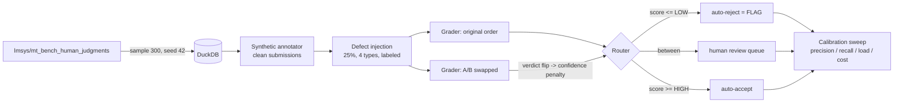

# second-reader

Every large-scale human data operation has the same quiet problem: the people
producing your training data are themselves a noisy process, and the QA layer
that watches them is usually a spreadsheet and a spot-check. second-reader is a
public-data approximation of that QA problem: it takes pairwise-preference
annotations (a vote plus a written justification, built on MT-Bench human
judgments), grades each submission against a versioned rubric with a single
Claude call, checks the grader against itself with an order-swap consistency
test, and routes every item to auto-accept, auto-reject (flag), or an explicit
human-review queue. Because defects are injected into a labeled subset, the
flagging decision has real ground truth — so precision, recall, review load,
and cost are measured, not asserted.

## Metrics

> **Status: the live metrics run is blocked on `ANTHROPIC_API_KEY` — see
> [STATUS.md](STATUS.md).** Nothing below pretends otherwise. The measurement
> machinery itself is fully verified two ways: (1) the precision/recall math
> is pytest-tested against a fixture with known labels
> ([tests/test_metrics.py](tests/test_metrics.py)), and (2) the entire
> pipeline ran end-to-end with a deterministic mock grader. The table below is
> from that **mock run**: it demonstrates the measurement, **not** model
> performance. `make run` (with a key set) regenerates this table with real
> claude-sonnet-4-5 numbers in `results/metrics.md`.

Operating point (HIGH=0.75, LOW=0.35), 300 items, 75 injected defects — **MOCK GRADER**:

| Metric | Value (mock) | Definition |
|---|---|---|
| Flag precision | 100.0% | of flagged items, how many were truly defective |
| Defect recall | 54.7% | of injected defects, how many were flagged |
| Human review load | 52.7% | items landing in the explicit no-decision queue |
| Cost / 1,000 items | $0.00 (mock) | from logged token counts; real run logs real cost |

Full sweep (63 threshold configurations): [results/mock/calibration.csv](results/mock/calibration.csv)
and [results/mock/metrics.md](results/mock/metrics.md). Real results will land
in [results/](results/) when the run executes.

## Recall by defect type

The single most interesting result in this project, never averaged away —
some defects are structurally harder to catch than others (mock run):

| Defect type | Injected | Recall (mock) | Why it's easy/hard |
|---|---|---|---|
| RUSHED | 19 | 100.0% | Sub-10-word justifications are trivially visible to a per-item grader |
| BOILERPLATE | 19 | 100.0%* | *only at LOW≥0.35; at LOW=0.10 recall is 0% — a single-item grader has no memory across items, so verbatim reuse is only caught when the text is also generic |
| SELF_CONTRADICTION | 18 | 16.7% | requires actually connecting the argument to the vote; fluent text that argues for B under a vote for A slips through when the responses are close in quality |
| POSITION_BIAS | 19 | 0.0% | the hardest by construction: 10 of the 19 injected items already had gold vote A, so forcing the vote to A changed nothing observable in that single item |

## Architecture



One Claude call grades each (item, order) pair against
[config/rubric_v1.yaml](config/rubric_v1.yaml) (versioned; the version string
is stamped on every grade row and every log line). Output is a validated
pydantic model — dimension scores 0–5, verdict, confidence, and a mandatory
reason — with a bounded 3-attempt retry that feeds validation errors back into
the prompt and then fails loud with the item_id. Every call is logged with
tokens, latency, and cost. Routing thresholds live in
[config/thresholds.yaml](config/thresholds.yaml), never in code.

## Design decisions and tradeoffs

- **Acceptance score, not raw confidence.** The router can't act on
  confidence alone: a *confident reject* and a *confident accept* both have
  confidence 0.9. Routing operates on `score = confidence` if accept else
  `1 − confidence`, so confident rejects land near 0 (flag) and uncertainty
  lands mid-band. Tradeoff: the two grader outputs (verdict, confidence) are
  collapsed into one scalar, discarding the distinction between "confidently
  borderline" and "unsure".
- **Order swap relabels everything, not just the responses.** The swapped call
  flips the responses *and* the submission's vote and letter references, so
  the semantic content is identical and any verdict flip is pure grader
  instability. A flip pulls the score toward 0.5 by a configurable
  `flip_penalty` — into the review band, never directly to reject. Tradeoff:
  2× grading cost for one bit of signal.
- **Synthetic justifications are a necessary fiction.** MT-Bench has votes but
  no written rationales, so clean submissions are Claude-written. This makes
  clean items more fluent and more uniform than real crowd work — which
  inflates precision (defects stand out against unnaturally clean
  backgrounds). Real-world numbers would be worse. Said plainly rather than
  hidden.
- **Defects are injected, so recall is real but narrow.** Recall is measured
  against the four defect types we chose to plant — it says nothing about
  defect types we didn't model (see coverage gaps).
- **Gold votes come from a single human each.** MT-Bench "ground truth" is one
  person's preference; some clean items are legitimately arguable. That puts a
  ceiling on flag precision that is a property of the dataset, not the grader.
- **Mock mode is plumbing insurance, not evaluation.** The mock grader writes
  to a separate DuckDB file and `results/mock/`, and every log row is marked
  `mock=true`. It exists so the measurement code path is proven before a
  dollar is spent; its numbers are never publishable.
- **DuckDB as the single source of truth.** Items, submissions, defect ground
  truth, both grades per item, routing, and the full call log live in one
  local file. Idempotent re-runs: anything already graded is never re-graded.

## Named failure mode inventory

Things the system provably does not catch, each reproducible from the CLI
(commands shown against the mock DB; drop `--mock` after a real run):

1. **POSITION_BIAS when the gold vote was already A.** Forcing the vote to A
   is a no-op for ~half the injected items (10/19 in this sample); the only
   remaining signal is a swapped-in generic justification. A per-item grader
   cannot see a *rate* of A-votes.
   `python -m second_reader report --mock --defect POSITION_BIAS`
2. **BOILERPLATE below the generic-text threshold.** The grader sees one item
   at a time and has no cross-item memory, so verbatim template reuse is only
   caught insofar as the text is also vague. At LOW=0.10 the mock sweep shows
   0% BOILERPLATE recall (see rows in `results/mock/calibration.csv`).
   `python -m second_reader report --mock --defect BOILERPLATE`
3. **Fluent self-contradiction on close-quality pairs.** When both responses
   are decent, a justification arguing for the un-voted response still reads
   plausibly and mostly survives; 15/18 slipped past the flag tier in the
   mock run. `python -m second_reader report --mock --defect SELF_CONTRADICTION`
4. **Annotator-level patterns of any kind.** Nothing aggregates by annotator
   (there is no annotator id in this simulation): a worker who is 10% rushed
   on every item looks like 30 independent borderline items. Not reproducible
   because it is not represented — that is the point.
5. **Wrong-but-well-argued votes.** A vote against gold with a specific,
   internally consistent justification scores well on 3 of 4 rubric
   dimensions. Inspect any flagged-vs-missed pair with
   `python -m second_reader show --mock --item-id <id>`.

## Known coverage gaps and what I'd build next

- **Per-annotator aggregation** — simulate N annotators with defect *rates*
  instead of per-item defects, and flag annotators, not items. This is the
  single highest-value next step; it is where position bias and boilerplate
  actually become catchable.
- **Cross-item dedup** for boilerplate: an exact/fuzzy hash over
  justifications before any model call — cheaper than the grader and catches
  what the grader provably cannot.
- **A second rubric version** (`rubric_v2.yaml`) and an A/B harness over the
  same items — versioning is already stamped end-to-end; the comparison
  report is not built.
- **Calibration of grader confidence** (reliability diagram / ECE): the sweep
  treats confidence as ordinal, but nothing verifies that 0.8 means 80%.
- **Tie handling**: ties were filtered at load; a real operation needs a
  "both fine" lane rather than pretending every pair has a winner.

## Running it

```
make setup            # uv venv + deps
export ANTHROPIC_API_KEY=sk-ant-...
make run              # full pipeline, 300 items (~$5–7, resumable)
make mock             # zero-API plumbing verification
make test             # 28 tests: schemas, retry, injection, metrics math
```

Stack: Python 3.11+, DuckDB, Polars, pydantic, anthropic SDK
(claude-sonnet-4-5), datasets. No web framework, no Docker.
