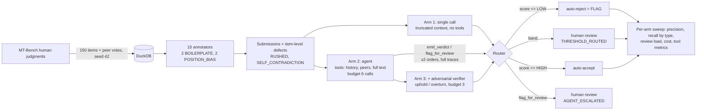

# second-reader

**Results at a glance:** [interactive readout](https://ahdithanu.github.io/second-reader/) · full tables in [results/metrics.md](results/metrics.md)

Every large-scale human data operation has the same quiet problem: the people
producing your training data are themselves a noisy process, and the QA layer
that watches them is usually a spreadsheet and a spot-check. second-reader is
a public-data approximation of that QA problem, built on MT-Bench human
judgments: 15 synthetic annotators submit pairwise-preference votes with
written justifications; four of those annotators are defective in ways that
are **invisible item-by-item** (verbatim template reuse, always voting the
same side), and a labeled share of the remaining items carry item-level
defects (rushed one-liners, justifications that contradict the vote). A
**tool-using grader agent** — starting from deliberately truncated context —
decides for itself whether to pull the annotator's history, peer judgments,
or the full response texts before emitting a rubric-scored verdict or
escalating to a human. Ground truth is recorded at both the annotator and
item level, so the flagging decision has real precision and recall — and the
same items are also graded by a tool-less single call and by a
grader-plus-adversarial-verifier pair, so the value of each layer of agency
is *measured*, not asserted.

All numbers below are from the live claude-sonnet-4-5 run (150 items, 66
defective, 2 orders × 3 arms = 900 graded runs, $22.12 total, everything
logged). Regenerate with `make run`; the machinery is separately verified by
40 pytest tests and a zero-API mock pipeline (`make mock`, quarantined in
`results/mock/`).

## Headline: recall by defect type, across the three arms

Operating point HIGH=0.75 / LOW=0.35. *Recall* = auto-flagged. *Catch* =
auto-flagged or agent-escalated to a human.

| Defect type | Recall, tools OFF | Recall, tools ON | Catch, tools ON | Recall, ON + verifier | Catch, ON + verifier |
|---|---|---|---|---|---|
| RUSHED (14) | 100.0% | 85.7% | 100.0% | 85.7% | 100.0% |
| BOILERPLATE (20) | 85.0% | 100.0% | 100.0% | 100.0% | 100.0% |
| POSITION_BIAS (18) | 22.2% | 22.2% | 44.4% | 16.7% | 38.9% |
| SELF_CONTRADICTION (14) | 100.0% | 78.6% | 100.0% | 64.3% | 85.7% |
| **Overall (66)** | **74.2%** | **71.2%** | **84.8%** | **66.7%** | **80.3%** |

| Arm | Flag precision | Review load | Cost / 1k items |
|---|---|---|---|
| tools OFF (single call) | 84.5% | 6.0% | $23.00 |
| tools ON (agent) | 79.7% | 26.7% | $74.77 |
| ON + adversarial verifier | 89.8% | 49.3% | $121.09 |

Three findings worth the price of the project:

1. **A single tool-less call is far stronger than expected on item-local
   defects** — 100% on RUSHED and SELF_CONTRADICTION from truncated context
   alone, and even 85% on BOILERPLATE (the reused template is *generic*, and
   generic text fails the specificity dimension without any history lookup).
   The pre-run assumption that annotator-scoped defects sit at 0% without
   tools was wrong in one direction: template reuse leaks through style.
2. **The agent converts flags into escalations.** Its flag-recall is
   *lower* than the single call (71.2% vs 74.2%) but its catch is 84.8%:
   given tools and an escape hatch, the agent prefers sending hard cases to
   a human over auto-rejecting them. You don't buy more automation with
   agency — you buy better triage, and a 4.5× bigger review queue.
3. **The adversarial verifier is a measured negative result.** It overturned
   30% of verdicts (90/300), which raised precision to 89.8% — and cost
   recall, catch, and review load in exchange. The sweep confirms it is
   dominated: its best configuration only ties the agent's 84.8% catch at
   worse review load and precision, for 62% more money. Kept in the results
   because a portfolio about measurement should show a layer that didn't pay.

## The hill-climb: closing the position-bias gap for $0

The failure inventory said it, so we built it: pattern defects need
annotator-level evidence, not smarter per-item grading. **Layer 0** computes
two deterministic signals per annotator from the submissions table alone —
share of votes on their most-voted side, and share of items reusing their
most-repeated justification — and auto-rejects every item of a flagged
annotator. No model calls. Zero added cost. Thresholds in
[config/thresholds.yaml](config/thresholds.yaml); reproduce with
`python -m second_reader aggregates`.

It flagged exactly the 4 planted defective annotators, with zero false
positives (the closest clean annotator sits at 0.90 side-ratio, under the
0.95 threshold). The numbers moved:

| System | Recall | Catch | Precision | Review load | Cost / 1k |
|---|---|---|---|---|---|
| Single call alone | 74.2% | 74.2% | 84.5% | 6.0% | $23.00 |
| **Single call + Layer 0** | **100.0%** | **100.0%** | **88.0%** | **4.0%** | **$23.00** |
| Agent alone | 71.2% | 84.8% | 79.7% | 26.7% | $74.77 |
| Agent + Layer 0 | 92.4% | 100.0% | 83.6% | 22.7% | $74.77 |

POSITION_BIAS: 22.2% → 100%. BOILERPLATE: 85% → 100% on the cheap arm. And
the conclusion that revises this project's own earlier headline: **the best
measured system is now the cheapest one** — a single call plus free SQL beats
the agent on every axis at this defect taxonomy. The agent's remaining edge
is triage quality on item-local ambiguity, not pattern detection.

Stated honestly: 100% is partly by construction. The planted annotator
defects are *total* (every item of a defective annotator), which is exactly
what aggregation sees best. An annotator defective on 3 of 10 items sits
below these thresholds — failure mode 5 is unchanged, and measuring the
detection-threshold curve on partial-rate defectors is the next experiment.

## What the tool loop does and does not help with

- **Helps**: BOILERPLATE (85%→100%: history turns "suspiciously generic"
  into "verbatim duplicate, certain") and POSITION_BIAS triage (22%→44%
  caught, almost entirely via escalation, not flags).
- **Does not help**: RUSHED and SELF_CONTRADICTION were already saturated
  without tools — the agent actually *flags* fewer of them, escalating
  instead. And POSITION_BIAS remains the hardest defect even with the
  annotator's full all-A history in hand: 10 of 18 items sailed through
  both arms uncaught, because on any single item the vote looks defensible
  and graders hesitate to convict on pattern evidence alone.
- Mean **4.06 evidence calls per run**, nearly uniform across defect types
  (4.0–4.1) — the real agent reads everything every time rather than
  early-exiting when history settles the question. That uniformity is why
  its cost is flat and its cap-hit rate is only 1.3%.

## Cost against recall, honestly

The agent arm buys +10.6 catch points over the single call for +$51.77 per
1,000 items — **$4.88 per point**. At this dataset's 44% defect rate that is
~47 extra caught defects per 1,000 items, about **$1.11 per additional
caught defect**; at a realistic production defect rate of ~5% the same token
spend buys only ~5 extra catches, ~$10 each. As token spend, either is cheap.
The real bill is human attention: review load rises from 6.0% to 26.7%,
+207 human reviews per 1,000 items, and that queue — not the API — is what
the agent arm has to justify. It does so only if triage quality matters: its
escalations are 3× denser in true defects than the threshold band's (next
section). The verifier arm is not worth running
at any measured configuration: $121/1k for less catch than the agent alone.
If false flags were expensive (e.g. annotator pay disputes), its 89.8%
precision would be the one reason to reconsider.

## Escalation paths

23 items were agent-escalated (`flag_for_review`), 17 threshold-routed into
the review band — overlap is structurally impossible (an escalating run
emits no verdict, hence no score), so the honest comparison is queue
quality: **39% of the agent's escalations were truly defective vs 12% of
the threshold band's**. The agent's own "I can't decide" signal is a 3×
better use of human time than the confidence band. Per-item detail, with
the other order's verdict for every escalated item, is in the escalation
section of [results/metrics.md](results/metrics.md).

## Example trace: the agent catching a self-contradiction

Verbatim from the traces table
([results/example_trace.json](results/example_trace.json); reproduce with
`python -m second_reader trace --item-id 0ca7bfac4994`):

```
api_round   in=2013 out=178 (3164ms)
tool_call   get_full_response {"item_id": "0ca7bfac4994", "which": "a"}
tool_call   get_full_response {"item_id": "0ca7bfac4994", "which": "b"}
tool_call   get_peer_judgments {"item_id": "0ca7bfac4994"}
api_round   in=3114 out=63 (1789ms)
tool_call   get_annotator_history {"annotator_id": "ann_05", "limit": 10}
api_round   in=4462 out=200 (5348ms)
escalation  "Critical misalignment between annotator's vote and justification.
             The annotator voted for Response A but the justification clearly
             argues for Response B, stating 'Response B correctly solves the
             probl…'"
```

Note it *escalated* rather than rejected — the behavioral signature behind
finding 2 above, visible in a single trace. Every one of the 900 graded runs
has a stored trace; the trace is a deliverable, not a debug artifact.

## Architecture



The agent starts from partial context (responses truncated to 200 chars) and
terminates only through a tool: `emit_verdict` (validated against
[config/rubric_v1.yaml](config/rubric_v1.yaml), version stamped everywhere)
or `flag_for_review`. Hitting the budget forces a verdict with
`budget_exhausted` recorded. Each item is graded twice per arm with the
whole world relabeled A↔B (responses, vote, justification, history, peer
votes) — a verdict flip is grader instability and pulls the score toward the
review band. The verifier receives the agent's verdict and must uphold
(confidences averaged) or overturn (verdict flips, confidence penalized
toward the band); grader escalations are inherited, never re-judged. All
thresholds, budgets, and penalties live in
[config/thresholds.yaml](config/thresholds.yaml). Every API round is logged
with tokens, latency, and cost.

## Design decisions and tradeoffs

- **Annotator-scoped defects are the honest version of the hard problem.**
  Injecting position bias per-item made half the injections no-ops (gold was
  already A). At the annotator level every item of a biased annotator is
  truly defective and nothing about a single item proves it. Tradeoff:
  defect counts per type follow annotator workloads, so they're uneven.
- **Truncated starting context is what makes the agent an agent.** With full
  context up front, tools would be decoration. Tradeoff: the tools-off arm
  is handicapped by the same truncation — the ablation measures *evidence
  gathering*, not long-vs-short context. Given that handicap, its 74.2%
  recall is the strongest per-dollar result in the table.
- **Acceptance score, not raw confidence.** A confident reject and a
  confident accept both carry confidence 0.9; routing needs them at opposite
  ends: `score = confidence` if accept else `1 − confidence`.
- **Escalated items have no score, on purpose.** The escalating run emitted
  no verdict; synthesizing a confidence for it would fabricate exactly the
  kind of number this project exists to measure. Consequence: `recall`
  (flags only) and `catch` (flags ∪ escalations) are always shown side by
  side, never blended.
- **The verifier's overturn penalty routes disagreement to humans.** An
  overturned verdict lands near the review band rather than auto-flipping —
  two agents disagreeing is a reason for a person to look, not for the
  second agent to win. This is why the verifier arm's review load doubles:
  the design worked as specified, and the specification is what proved
  expensive.
- **Synthetic justifications are a necessary fiction.** MT-Bench has votes
  but no rationales, so clean submissions are Claude-written — more fluent
  and uniform than real crowd work, which flatters precision. Real-world
  numbers would be worse.
- **Mock mode is plumbing insurance, not evaluation.** It also turned out to
  be a caution: the mock's hand-written heuristics predicted 0% tools-off
  recall on annotator defects; the real model got 85% on BOILERPLATE through
  sheer style-reading. Simulated graders mispredict real ones — which is
  why the mock's numbers are quarantined and never published as results.

## Named failure mode inventory

Things the system provably does not catch, each reproducible from the CLI:

1. **Position bias per-item — CLOSED by Layer 0.** 10 of 18 POSITION_BIAS
   items passed both the flag and escalation paths in the agent arm; the
   grader holds the annotator's all-A history and still won't convict a
   single defensible-looking vote on pattern evidence. The fix wasn't a
   smarter grader — it was annotator-level aggregation (see the hill-climb
   section): 22.2% → 100% for $0. Kept here as the project's one completed
   loop: measured miss → named cause → shipped fix → number moved.
   `python -m second_reader aggregates`
2. **The agent under-flags what it could auto-reject.** 2 RUSHED and 3
   SELF_CONTRADICTION items that the single call flagged outright were
   escalated instead by the agent — caught, but at human cost. Compare:
   `python -m second_reader report --mode single --defect RUSHED` vs
   `--mode agent`.
3. **The verifier overturns correct rejects.** Flag recall drops 71.2%→66.7%
   and SELF_CONTRADICTION catch drops to 85.7% because "do not rubber-stamp"
   produces overturns of true positives too.
   `python -m second_reader report --mode verifier --defect SELF_CONTRADICTION`
4. **Budget-starved runs.** 1.3% of agent runs hit the 6-call cap and were
   forced to a verdict on partial evidence (`budget_exhausted` in grades).
   `python -m second_reader trace --item-id <id>` on any `hit_cap` trace row.
5. **Defect *rates* below the pattern threshold.** An annotator boilerplating
   3 of 10 items defeats a history check that catches 10 of 10. Not in the
   injected taxonomy — by design, and listed so it isn't mistaken for covered.

## Known coverage gaps and what I'd build next

- **Partial-rate defective annotators.** Layer 0 (shipped — see the
  hill-climb) catches *total* pattern defects; an annotator boilerplating 3
  items in 10 defeats its thresholds. Inject mixed-rate annotators and
  measure the detection-threshold curve — the natural follow-up experiment.
- **A targeted verifier** — reviewing only the review band and near-threshold
  flags (instead of all 300 runs) keeps its precision gain at a fraction of
  its cost; the all-items version measured here is the expensive baseline.
- **Confidence calibration** (reliability diagram / ECE): the sweep treats
  confidence as ordinal; nothing verifies 0.8 means 80%.
- **Tie handling**: ties were filtered at load; a real operation needs a
  "both fine" lane rather than pretending every pair has a winner.

## Running it

```
make setup            # uv venv + deps
export ANTHROPIC_API_KEY=sk-ant-...   # or put it in ./.env
make run              # all three arms, 150 items (~$22 from scratch, resumable)
make mock             # zero-API plumbing verification (separate DB + results/mock/)
make test             # 40 tests: schemas, agent loop, verifier, injection, metrics math
```

Useful inspection: `annotators` (defect truth per annotator), `show
--item-id`, `trace --item-id [--mode verifier]` (verbatim traces), `report
--mode single|agent|verifier --defect TYPE` (missed items). Full sweep:
[results/calibration.csv](results/calibration.csv) (189 configs); rendered
tables: [results/metrics.md](results/metrics.md).

Stack: Python 3.11+, DuckDB, Polars, pydantic, anthropic SDK
(claude-sonnet-4-5, tool use API), datasets. No web framework, no Docker.
